# Proyecto React, api y asp.net

Esta es la primera parte de un tutorial de cómo crear una aplicación web usando ASP.Net, Entity Framework, JWT, APi-Rest, Fluent-Api y React.
Ambas partes son parte de un conjunto, pero pueden aprenderse por separado. En esté en particular vamos a conectarnos a una base de datos que necesita un token de autenticación para acceder.

>Advertencia: este trabajo es simplemente para demostracion, por lo que para cubir algunos temas, vamos a hacer a hacer cosas de manera ineficiente. Tengalo en cuenta

##Instalacion de dependencia

Para comenzar este tutorial vamos a ir a la terminal de comando para crear un nuevo proyecto.

    dotnet new react -o my-new-app

Luego entraremos en la carpeta donde esta los archivos de React.js y vamos a intalar las dependencias

    cd my-new-app
    npm i

Para comenzar empezaremos por trabajar en el backend, desde C# para comenzar crearemos una carpeta llamada Models donde guardaremos nuestras clases. En el crearemos los modelos que vamos a usar. Para mayor seguridad, primero crearemos una rama aparte donde trabajaremos con los archivos relacionados con los usuarios.

Una vez creado la rama en nuestro repositorio vamos a instalar las dependencias que vamos a necesitar para hacer nuestro proyecto. Actualmente estoy trabajando con ASp.net 6.0

    dotnet add package AutoMapper --version 12.0.1
    dotnet add package AutoMapper.Extensions.Microsoft.DependencyInjection --version 12.0.1

Estas dependencias nos servirán para copiar un objeto de otro. En esencia las clases son iguales, pero tiene propósitos diferentes. La intención de AutoMapper (o de cualquier mapper) es ahorrarnos la molestia de tener que asignar las propiedades de clase Type A a clase Type B.

    dotnet add package BCrypt.Net-Next --version 4.0.3

Esta dependencia nos va a brindar la encriptación de nuestras contraseñas.

    dotnet add package Microsoft.AspNetCore.Authentication.JwtBearer --version 6.0.8
    dotnet add package System.IdentityModel.Tokens.Jwt --version 6.15.1

JSON Web Token (JWT) es un estándar para transmitir información de forma segura en internet, por medio de archivos en formato JSON

    dotnet add package Microsoft.EntityFrameworkCore --version 6.0.8
    dotnet add package Microsoft.EntityFrameworkCore.Design --version 6.0.8
    dotnet add package Microsoft.EntityFrameworkCore.SqlServer --version 6.0.8

Entity Framework es una herramienta de las catalogadas como ORM (Object Relational Mapping o mapeo a objetos de las bases de datos relacionales) que permite trabajar con las bases de datos relacionales a alto nivel, evitando las complejidades y particularidades del manejo de las tablas de bases de datos, sus relaciones y el uso de SQL.

>nota: Si esta trabajando con versiones diferente de .Net asegurece que las versiones de Entity framework coindidan con la version de .Net o tendra problemas.
>Nota amistosa: en esta parte no llegaremos a cubrir la parte de los usuarios y todo lo relacionado a tal, solo aprenderemos a crear una base de datos, conectarla, hacer peticiones y demas.

## Creacion de modelos para la base de datos
Comenzaremos a crear modelos que deliniaran nuestra base de datos. Antes de comenzar quiero decir nos ayuda a crear relaciones y las tablas de una manera facil y rapida. Como ya hable este tema en [trabajo anterior](https://github.com/leandroVece/Entity-Framenwork) solo voy a dejar la [documentacion](https://learn.microsoft.com/es-es/ef/ef6/modeling/code-first/fluent/relationships) y voy a seguir dando por entendido algunas cosas solo retomando en lo que es importante.

**Path:Models/Pedido.cs**

    using System.ComponentModel.DataAnnotations.Schema;
    using System.Text.Json.Serialization;

    namespace Cadeteria.Models;

    public partial class Pedido
    {
        public Guid Id_pedido { get; set; }
        [NotMapped]
        [JsonIgnore]
        public virtual Guid CadeteForeingKey { get; set; }
        public virtual Guid ClienteForeingKey { get; set; }
        public string Obs { get; set; }
        public string Estado { get; set; }

        [NotMapped]
        [JsonIgnore]
        public virtual Clientes? Cliente { get; set; }

        [NotMapped]
        [JsonIgnore]
        public virtual Cadetes? Cadete { get; set; }

        [NotMapped]
        [JsonIgnore]
        public virtual CadetesPedido? Cadp { get; set; }
    }

**Path:Models/Cadete.cs**

    using System.ComponentModel.DataAnnotations.Schema;
    using System.Text.Json.Serialization;

    namespace Cadeteria.Models;
    public class Cadetes
    {
        public Guid Id_cadete { get; set; }
        [NotMapped]
        [JsonIgnore]
        public Guid PedidoForeingKey { get; set; }
        public string Nombre { get; set; }
        public string Direccion { get; set; }
        public string Telefono { get; set; }

        [NotMapped]
        [JsonIgnore]
        public virtual ICollection<Pedido>? listaPedido { get; set; }

        [NotMapped]
        [JsonIgnore]
        public virtual List<CadeteCliente>? CadClien { get; set; }
        [NotMapped]
        [JsonIgnore]
        public virtual List<CadetesPedido>? Cadp { get; set; }
    }

**Path:Models/CadetePedido.cs**

    using System.ComponentModel.DataAnnotations.Schema;
    using System.Text.Json.Serialization;

    namespace Cadeteria.Models;

    public class CadetesPedido
    {

        public Guid Id_cadPed { get; set; }
        public virtual Guid CadeteForeingKey { get; set; }
        public virtual Guid PedidoForeingKey { get; set; }

        [NotMapped]
        [JsonIgnore]
        public virtual Cadetes? Cadete { get; set; }

        [NotMapped]
        [JsonIgnore]
        public virtual Pedido? Pedido { get; set; }
    }

**Path:Models/Cliente.cs**

    using System.ComponentModel.DataAnnotations.Schema;
    using System.Text.Json.Serialization;

    namespace Cadeteria.Models;
    public class Clientes
    {
        public Guid Id_cliente { get; set; }
        public string Nombre { get; set; }
        public string Direccion { get; set; }
        public string Telefono { get; set; }
        public string? Referencia { get; set; }

        [NotMapped]
        [JsonIgnore]
        public virtual ICollection<Pedido>? listaPedido { get; set; }

        [NotMapped]
        [JsonIgnore]
        public virtual List<CadeteCliente>? Cadp { get; set; }
        [NotMapped]
        [JsonIgnore]
        public virtual List<CadeteCliente>? CadClien { get; set; }
    }

**Path:Models/CadeteCliente.cs**

    using System.ComponentModel.DataAnnotations.Schema;
    using System.Text.Json.Serialization;

    namespace Cadeteria.Models;

    public class CadeteCliente
    {
        public Guid Id_cadClient { get; set; }
        public virtual Guid CadeteForeingKey { get; set; }
        public virtual Guid ClienteForeingKey { get; set; }

        [NotMapped]
        [JsonIgnore]
        public virtual Cadetes? Cadete { get; set; }

        [NotMapped]
        [JsonIgnore]
        public virtual Clientes? Cliente { get; set; }
    }

Una vez creados los modelos vamos a crear un nuevo archivo llamado DataContext donde vamos a determinar que tipo de valores tomaran cada atributo en nuestra base de datos.
**Path:Helpers/DataContext.cs**

    using Cadeteria.Models;
    using Microsoft.EntityFrameworkCore;

    namespace Cadeteria;

    public class DataContext : DbContext
    {
        public DbSet<Cadetes> Cadetes { get; set; }
        public DbSet<Clientes> Clientes { get; set; }
        public DbSet<Pedido> Pedido { get; set; }
        public DbSet<CadeteCliente> CadCliente { get; set; }
        public DataContext(DbContextOptions<DataContext> options) : base(options) { }

        protected override void OnModelCreating(ModelBuilder modelBuilder)
        {
            List<Cadetes> listCadete = new List<Cadetes>();
            listCadete.Add(new Cadetes() { Id_cadete = Guid.Parse("7b5e9399-8e95-4ae8-8745-9542a01e2cc0"), Nombre = "Jaun Castellanos", Direccion = "Entre rios", Telefono = "231321231" });
            listCadete.Add(new Cadetes() { Id_cadete = Guid.Parse("0a9fa564-0604-4dfa-88df-3636fe395651"), Nombre = "Ana Hume", Direccion = "independencia", Telefono = "231321231" });
            listCadete.Add(new Cadetes() { Id_cadete = Guid.Parse("0a9fa564-0604-4dfa-88df-3636fe395678"), Nombre = "Fer Hume", Direccion = "independencia", Telefono = "654321" });

            modelBuilder.Entity<Cadetes>(Cadete =>
            {
                Cadete.ToTable("cadete");
                Cadete.HasKey(c => c.Id_cadete);
                Cadete.Property(c => c.Id_cadete).IsRequired().ValueGeneratedOnAdd();

                Cadete.Property(c => c.Nombre).IsRequired().HasMaxLength(20);
                Cadete.Property(c => c.Direccion).IsRequired();
                Cadete.Property(c => c.Telefono).IsRequired();

                Cadete.Ignore(x => x.listaPedido);
                Cadete.Ignore(x => x.Cadp);
                Cadete.HasData(listCadete);
            });

            List<Clientes> listaCliente = new List<Clientes>();
            listaCliente.Add(new Clientes() { Id_cliente = Guid.Parse("7b5e9399-8e95-4ae8-8745-9542a01e2cc3"), Nombre = "Pancho Castellanos", Direccion = "Entre rios", Telefono = "5231234" });
            listaCliente.Add(new Clientes() { Id_cliente = Guid.Parse("7b5e9399-8e95-4ae8-8745-9542a01e2cc1"), Nombre = "Lucio Hume", Direccion = "independencia", Telefono = "8321156" });
            listaCliente.Add(new Clientes() { Id_cliente = Guid.Parse("7b5e9399-8e95-4ae8-8745-9542a01e2cc5"), Nombre = "Val Hume", Direccion = "independencia", Telefono = "975313" });

            modelBuilder.Entity<Clientes>(Clientes =>
            {
                Clientes.ToTable("cliente");
                Clientes.HasKey(p => p.Id_cliente);
                Clientes.Property(p => p.Id_cliente).IsRequired().ValueGeneratedOnAdd();

                Clientes.Property(p => p.Nombre).IsRequired().HasMaxLength(20);
                Clientes.Property(p => p.Direccion).IsRequired().HasMaxLength(100);
                Clientes.Property(p => p.Telefono).IsRequired().HasMaxLength(20);
                Clientes.Property(p => p.Referencia);

                Clientes.HasData(listaCliente);
            });

            modelBuilder.Entity<Pedido>(Pedido =>
            {
                List<Pedido> Listped = new List<Pedido>();
                Listped.Add(new Pedido()
                {
                    Id_pedido = Guid.Parse("adc4aba6-b2b6-4ca6-a715-e563987fd02e"),
                    ClienteForeingKey = Guid.Parse("7b5e9399-8e95-4ae8-8745-9542a01e2cc3"),
                    Obs = "Coca",
                    Estado = "Pendiente"
                });

                Pedido.ToTable("pedido");
                Pedido.HasKey(p => p.Id_pedido);
                Pedido.HasOne(cli => cli.Cliente).WithMany(ped => ped.listaPedido).HasForeignKey(c => c.ClienteForeingKey);

                Pedido.Property(p => p.Id_pedido).IsRequired().ValueGeneratedOnAdd();
                Pedido.Property(p => p.Obs).IsRequired().HasMaxLength(50);
                Pedido.Property(p => p.Estado).IsRequired().HasMaxLength(12);

                Pedido.HasData(Listped);
            });

            modelBuilder.Entity<CadeteCliente>(CC =>
            {
                CC.ToTable("cadeteCliente");
                CC.HasKey(CC => CC.Id_cadClient);
                CC.Property(CC => CC.Id_cadClient).IsRequired().ValueGeneratedOnAdd();

                CC.HasOne(c => c.Cadete).WithMany(cc => cc.CadClien).HasForeignKey(c => c.CadeteForeingKey).OnDelete(DeleteBehavior.Restrict);
                CC.HasOne(c => c.Cliente).WithMany(cc => cc.CadClien).HasForeignKey(c => c.ClienteForeingKey).OnDelete(DeleteBehavior.Restrict);
            });

            modelBuilder.Entity<CadetesPedido>(CP =>
            {
                CP.ToTable("cadetePedido");
                CP.HasKey(CC => CC.Id_cadPed);
                CP.Property(CC => CC.Id_cadPed).IsRequired().ValueGeneratedOnAdd();

                CP.HasOne(c => c.Cadete).WithMany(cp => cp.Cadp).HasForeignKey(c => c.CadeteForeingKey).OnDelete(DeleteBehavior.Restrict);
                CP.HasOne(p => p.Pedido).WithOne(cp => cp.Cadp).HasForeignKey<CadetesPedido>(p => p.PedidoForeingKey).OnDelete(DeleteBehavior.Restrict);
            });
        }
    }

Con Podemos ver nuestra base de datos esta relacionada de 3 formas distitas. relacion
- Relacion 1:N sin tabla intermedia con Cliente-pedido.
- Relacion 1:N con tabla intermedia con Cadete-pedido.
- Relacion N:N con Cadete-cliente.

Con esto, una vez que iniciemos las migraciones, Nuestra base de datos sera creada con los valores que dimos en nuestro dataContext. No obtante, antes de iniciar la migracion tenemos que crear la conexion, si no EF no tendrea un lugar donde crear nuestra DB.
**Path:appSettings.json**

    {
        "Logging": {
            "LogLevel": {
            "Default": "Information",
            "Microsoft": "Warning",
            "Microsoft.Hosting.Lifetime": "Information"
            }
        },
        "AllowedHosts": "*",
        "ConnectionStrings": {
            "SQLServer": "data source=DESKTOP-R16IMC7;Initial Catalog=Cadeteria;Trusted_Connection=True; TrustServerCertificate=True;"
        }
    }

**Path:Program.cs**

    using Cadeteria;

    var builder = WebApplication.CreateBuilder(args);

    // Add services to the container.

    builder.Services.AddControllersWithViews();

    builder.Services.AddSqlServer<DataContext>(builder.Configuration.GetConnectionString("SQLServer"));

    var app = builder.Build();

    // Configure the HTTP request pipeline.
    if (!app.Environment.IsDevelopment())
    {
        // The default HSTS value is 30 days. You may want to change this for production scenarios, see https://aka.ms/aspnetcore-hsts.
        app.UseHsts();
    }

    app.UseHttpsRedirection();
    app.UseStaticFiles();
    app.UseRouting();

    app.MapControllerRoute(
        name: "default",
        pattern: "{controller}/{action=Index}/{id?}");

    app.MapFallbackToFile("index.html"); ;

    app.Run();

Con todo preparado podemos crear nuestra base de datos iniciando las migraciones.

    dotnet ef migrations add InitialCreate
    dotnet ef database update

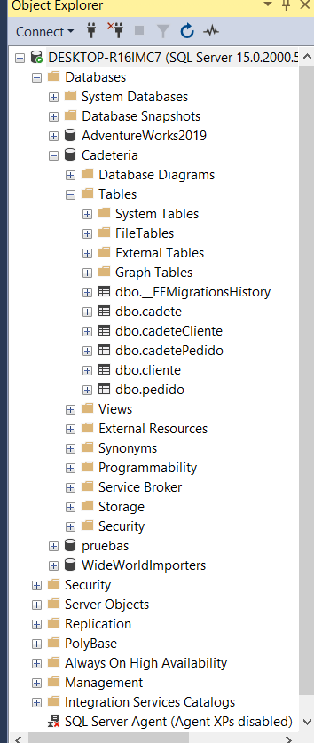

## Creacion de los servicios.

Modelo-vista-controlador es un patrón de arquitectura de software, que separa los datos y principalmente lo que es la lógica de negocio de una aplicación de su representación y el módulo encargado de gestionar los eventos y las comunicaciones. En una aplicación de MVC, la vista solo muestra información; el controlador controla y responde a la interacción y los datos que introducen los usuarios.

Para conectar esto, necesitaremo repositorios que nos ayudaran a crear la logica para determinar que tipo de servicios vamos a estar consumiendo y de donde.

>Nota: En esta documentacion lo presento como un archivo unico, pero es una buena practica mantenerlo por separado, sin embargo como es mucho trabajo vamos a dejarlo juntos y cada uno lo separa segun como lo tengo en mi repositorio o gustos.

**Paht:Services/CadeteClienteRepository.cs**

    using Cadeteria.Models;
    using Microsoft.AspNetCore.Mvc.RazorPages;

    namespace Cadeteria;

    public interface ICadeteClienteRepository
    {
        public IEnumerable<CadeteCliente> Get();
        Task Save(CadeteCliente cadp);
        Task Delete(Guid id)
    }

    public class CadeteClienteRepository : ICadeteClienteRepository
    {

        DataContext context;
        public CadeteClienteRepository(DataContext dbContext)
        {
            context = dbContext;
        }

        public IEnumerable<CadeteCliente> Get()
        {
            return context.CadCliente;
        }

        public async Task Save(CadeteCliente cadClient)
        {
            context.Add(cadClient);
            await context.SaveChangesAsync();
        }

        public async Task Delete(Guid id)
        {
            var cp = context.CadPed.Find(id);
            //Console.WriteLine(pedidoAux.Nombre + " " + id);
            if (cp != null)
            {
                context.Remove(cp);
                await context.SaveChangesAsync();
            }
        }
    }

**Path:/services/CadetePedidoRepository.cs**

    using Cadeteria.Models;
    using Microsoft.AspNetCore.Mvc.RazorPages;

    namespace Cadeteria;
    public interface ICadetePedidoRepository
    {
        public IEnumerable<CadetesPedido> Get();
        Task Save(CadetesPedido cadp);
        Task Delete(Guid id);
    }

    public class CadetePedidoRepository : ICadetePedidoRepository
    {

        DataContext context;
        public CadetePedidoRepository(DataContext dbContext)
        {
            context = dbContext;
        }

        public IEnumerable<CadetesPedido> Get()
        {
            return context.CadPed;
        }

        public async Task Save(CadetesPedido cadp)
        {
            context.Add(cadp);
            await context.SaveChangesAsync();
        }

        public async Task Delete(Guid id)
        {
            var cp = context.CadPed.Find(id);
            //Console.WriteLine(pedidoAux.Nombre + " " + id);
            if (cp != null)
            {
                context.Remove(cp);
                await context.SaveChangesAsync();
            }
        }

    }

**Path:/services/CadeteRepository.cs**

    using Cadeteria.Models;

    namespace Cadeteria;

    public interface ICadeteRepository
    {

        IEnumerable<Cadetes> Get();
        Task Save(Cadetes cadete);
        Task Update(Guid id, Cadetes cadete);
        Task Delete(Guid id);

    }

    public class CadeteRepository : ICadeteRepository
    {

        DataContext context;
        public CadeteRepository(DataContext dbContext)
        {
            context = dbContext;
        }

        public IEnumerable<Cadetes> Get()
        {
            return context.Cadetes;
        }

        public async Task Save(Cadetes cadete)
        {
            context.Add(cadete);
            await context.SaveChangesAsync();
        }

        public async Task Update(Guid id, Cadetes cadete)
        {
            var cadeteAux = context.Cadetes.Find(id);

            if (cadeteAux != null)
            {
                cadeteAux.Nombre = cadete.Nombre;
                cadeteAux.Direccion = cadete.Direccion;
                cadeteAux.Telefono = cadete.Telefono;

                await context.SaveChangesAsync();
            }
        }

        public async Task Delete(Guid id)
        {
            var cadeteAux = context.Cadetes.Find(id);

            if (cadeteAux != null)
            {
                context.Remove(cadeteAux);
                await context.SaveChangesAsync();
            }
        }
    }

**Path:/services/ClienteRepository.cs**

    using Cadeteria.Models;
    using Microsoft.AspNetCore.Mvc.RazorPages;

    namespace Cadeteria;

    public interface IClienteRepository
    {
        IEnumerable<Clientes> Get();
        public Clientes GetById(Guid id);
        Task Save(Clientes cliente);
        Task Update(Guid id, Clientes cliente);
        Task Delete(Guid id);
    }

    public class ClienteRepository : IClienteRepository
    {

        DataContext context;
        public ClienteRepository(DataContext dbContext)
        {
            context = dbContext;
        }

        public IEnumerable<Clientes> Get()
        {
            return context.Clientes;
        }

        public Clientes GetById(Guid id)
        {
            return context.Clientes.Find(id);
        }

        public async Task Save(Clientes cliente)
        {
            context.Add(cliente);
            await context.SaveChangesAsync();
        }

        public async Task Update(Guid id, Clientes cliente)
        {
            var clienteAux = context.Clientes.Find(id);

            if (clienteAux != null)
            {
                clienteAux.Nombre = cliente.Nombre;
                clienteAux.Direccion = cliente.Direccion;
                clienteAux.Telefono = cliente.Telefono;

                await context.SaveChangesAsync();
            }
        }

        public async Task Delete(Guid id)
        {
            var clienteAux = context.Clientes.Find(id);

            if (clienteAux != null)
            {
                context.Remove(clienteAux);
                await context.SaveChangesAsync();
            }
        }
    }

**Path:/services/PedidoRepository.cs**

    namespace Cadeteria;

    public interface IPedidoRepository
    {
        public IEnumerable<Pedido> Get();
        Task Save(Pedido pedido);
        Task SaveCP(CadetesPedido cadp);
        Task Update(Guid id, Pedido pedido);
        Task Delete(Guid id);
    }

    public class PedidoRepository : IPedidoRepository
    {
        DataContext context;
        public PedidoRepository(DataContext dbContext)
        {
            context = dbContext;
        }

        public IEnumerable<Pedido> Get()
        {
            return context.Pedido;
        }

        public async Task Save(Pedido pedido)
        {
            context.Add(pedido);
            await context.SaveChangesAsync();
        }
        public async Task SaveCP(CadetesPedido cadp)
        {
            context.Add(cadp);
            await context.SaveChangesAsync();
        }

        public async Task Update(Guid id, Pedido pedido)
        {
            var pedidoAux = context.Pedido.Find(id);
            Console.WriteLine(id);

            if (pedidoAux != null)

                pedidoAux.Estado = pedido.Estado;
            pedidoAux.Obs = pedido.Obs;

            await context.SaveChangesAsync();
        }
        public async Task Delete(Guid id)
        {
            var pedidoAux = context.Pedido.Find(id);
            //Console.WriteLine(pedidoAux.Nombre + " " + id);
            if (pedidoAux != null)
            {
                context.Remove(pedidoAux);
                await context.SaveChangesAsync();
            }
        }
    }

Creado nuestros servicios vamos a inyectarlos en nuestro archivo Program.

**Path:program.cs**

    ...
    builder.Services.AddSqlServer<DataContext>(builder.Configuration.GetConnectionString("SQLServer"));

    builder.Services.AddScoped<ICadeteRepository, CadeteRepository>();
    builder.Services.AddScoped<IClienteRepository, ClienteRepository>();
    builder.Services.AddScoped<IPedidoRepository, PedidoRepository>();
    builder.Services.AddScoped<ICadetePedidoRepository, CadetePedidoRepository>();
    builder.Services.AddScoped<ICadeteClienteRepository, CadeteClienteRepository>();

    var app = builder.Build();
    ...

## Creacion de los Controladores

Los controladores, como su nombre indican, van a ser los que controlen el paso de informacion de la vista a nuestros modelos y redireccionandonos a nuestros destinos.
**Path:Controllers/CadeteClienteController.cs**

    using Cadeteria.Models;
    using Microsoft.AspNetCore.Mvc;

    namespace Cadeteria;

    [ApiController]
    [Route("api/[controller]")]
    public class CadeteClienteController : ControllerBase
    {
        private readonly DataContext _db;
        private readonly ICadeteClienteRepository _CC;
        private readonly ILogger<CadeteClienteController> _logger;

        public CadeteClienteController(ILogger<CadeteClienteController> logger, ICadeteClienteRepository cc, DataContext db)
        {
            _db = db;
            _CC = cc;
            _logger = logger;
        }

        [HttpGet]
        public IActionResult Get(Guid id)
        {
            try
            {
                var Response = _db.Clientes.Join(_db.CadCliente, client => client.Id_cliente, Cp => Cp.ClienteForeingKey,
                (client, Cp) => new { Cp.Id_cadClient, client.Id_cliente, client.Nombre, }).Join(_db.Cadetes, res => res.Id_cadClient, cad => cad.Id_cadete,
                (res, cad) => new { res.Id_cadClient, res.Id_cliente, res.Nombre, cad.Id_cadete, cad.NombreCad });
                return Ok(Response);
            }
            catch (System.Exception e)
            {
                Console.WriteLine("no se pudo: \n" + e.ToString());
                return Ok();
            }
        }
        [HttpGet("{id}")]
        public IActionResult GetById(Guid id)
        {
            try
            {
                var Response = _db.Clientes.Join(_db.CadCliente, client => client.Id_cliente, Cp => Cp.ClienteForeingKey,
                (client, Cp) => new { Cp.Id_cadClient, client.Id_cliente, client.Nombre, }).Join(_db.Cadetes, res => res.Id_cadClient, cad => cad.Id_cadete,
                (res, cad) => new { res.Id_cadClient, res.Id_cliente, res.Nombre, cad.Id_cadete, cad.NombreCad }).Where(x => x.Id_cadClient == id);
                return Ok(Response);
            }
            catch (System.Exception e)
            {
                Console.WriteLine("no se pudo: \n" + e.ToString());
                return Ok();
            }
        }

        [HttpPost]
        public IActionResult Post([FromBody] CadeteCliente cc)
        {

            try
            {
                _CC.Save(cc);
                return Ok();
            }
            catch (System.Exception e)
            {
                Console.WriteLine("error: \n" + e.ToString());
                throw;
            }
        }

        [HttpPut("{id}")]
        public IActionResult Put(Guid id_pedido, [FromBody] Pedido pedido)
        {
            return Ok();
        }

        [HttpDelete("{id}")]
        public IActionResult Delete(Guid id)
        {
            return Ok();
        }
    }

**Path:Controllers/CadetePedidoController.cs**

    using Cadeteria.Models;
    using Microsoft.AspNetCore.Mvc;

    namespace Cadeteria;

    [ApiController]
    [Route("api/[controller]")]
    public class CadetePedidoController : ControllerBase
    {
        private readonly DataContext _db;
        private readonly ICadetePedidoRepository _cp;
        private readonly ILogger<CadetePedidoController> _logger;

        public CadetePedidoController(ILogger<CadetePedidoController> logger, ICadetePedidoRepository cp, DataContext db)
        {
            _db = db;
            _cp = cp;
            _logger = logger;
        }

        [HttpGet]
        public IActionResult Get()
        {
            try
            {
                var response = _db.Clientes.Join(_db.Pedido, client => client.Id_cliente, ped => ped.ClienteForeingKey,
                (client, ped) => new { ped.Id_pedido, ped.ClienteForeingKey, ped.Obs, ped.Estado, client.Nombre }).Where(x => x.Estado == "Pendiente").ToList();
                return Ok(response);
            }
            catch (System.Exception e)
            {
                Console.WriteLine("no se pudo: \n" + e.ToString());
                return Ok();
            }
        }
        [HttpGet]
        [Route("action")]
        public IActionResult GetLista(Guid id)
        {
            try
            {
                var response = _db.Clientes.Join(_db.Pedido, client => client.Id_cliente, ped => ped.ClienteForeingKey,
                (client, ped) => new
                {
                    ped.Id_pedido,
                    ped.Obs,
                    ped.ClienteForeingKey,
                    ped.Estado,
                    client.Nombre
                }).Where(x => x.Estado == "En camino").ToList();

                return Ok(response);
            }
            catch (System.Exception e)
            {
                Console.WriteLine("no se pudo: \n" + e.ToString());
                return Ok();
            }
        }

        [HttpPost]
        public IActionResult Post([FromBody] CadetesPedido cadp)
        {

            try
            {
                _cp.Save(cadp);
                return Ok();
            }
            catch (System.Exception e)
            {
                Console.WriteLine("error: \n" + e.ToString());
                throw;
            }
        }

        [HttpPut("{id}")]
        public IActionResult Put(Guid id_pedido, [FromBody] Pedido pedido)
        {
            //_dbcadped.Update(id_pedido, pedido);
            return Ok();
        }
        [HttpDelete("{id}")]
        public IActionResult Delete(Guid id)
        {
            _cp.Delete(id);
            return Ok();
        }
    }

**Path:Controllers/CadeteController.cs**

    using Cadeteria.Models;
    using Microsoft.AspNetCore.Mvc;

    namespace Cadeteria;

    [ApiController]
    [Route("api/[controller]")]
    public class CadeteController : ControllerBase
    {
        private readonly ICadeteRepository _dbCadete;
        private readonly DataContext _db;
        private readonly ILogger<CadeteController> _logger;

        public CadeteController(ILogger<CadeteController> logger, ICadeteRepository cadete, DataContext db)
        {
            _db = db;
            _dbCadete = cadete;
            _logger = logger;
        }

        [HttpGet]
        public IActionResult Get()
        {
            return Ok(_dbCadete.Get());
        }
        [HttpPost]
        public IActionResult Post([FromBody] Cadetes cadete)
        {
            _dbCadete.Save(cadete);
            return Ok();
        }

        [HttpPut("{id}")]
        public IActionResult Put(Guid id, [FromBody] Cadetes cadete)
        {
            _dbCadete.Update(id, cadete);
            return Ok();
        }
        [HttpDelete("{id}")]
        public IActionResult Delete(Guid id)
        {
            _dbCadete.Delete(id);
            return Ok();
        }
    }

**Path:Controllers/PedidoController.cs**

    using Cadeteria.Models;
    using Microsoft.AspNetCore.Mvc;

    namespace Cadeteria;

    [ApiController]
    [Route("api/[controller]")]
    public class PedidoController : ControllerBase
    {
        private readonly DataContext _db;
        private readonly IPedidoRepository _dbPedido;
        private readonly ILogger<PedidoController> _logger;

        public PedidoController(ILogger<PedidoController> logger, IPedidoRepository pedido, DataContext db)
        {
            _dbPedido = pedido;
            _db = db;
            _logger = logger;
        }

        [HttpGet]
        public IActionResult Get()
        {
            try
            {
                var respose = _db.Clientes.Join(_db.Pedido, client => client.Id_cliente, ped => ped.ClienteForeingKey,
                (client, ped) => new { ped.Id_pedido, ped.ClienteForeingKey, ped.Obs, ped.Estado, client.Nombre }).ToList();
                return Ok(respose);
            }
            catch (System.Exception e)
            {
                Console.WriteLine("no se pudo: \n" + e.ToString());
                return Ok(_dbPedido.Get());
            }
        }

        [HttpPost]
        public IActionResult Post([FromBody] Pedido pedido)
        {
            _dbPedido.Save(pedido);
            return Ok();
        }

        [HttpPut("{id}")]
        public IActionResult Put(Guid id, [FromBody] Pedido pedido)
        {
            //Console.WriteLine(id);
            _dbPedido.Update(id, pedido);
            return Ok();
        }

        [HttpDelete("{id}")]
        public IActionResult Delete(Guid id)
        {
            try
            {
                Console.WriteLine(id);
                _dbPedido.Delete(id);
                return Ok();

            }
            catch (System.Exception e)
            {
                Console.WriteLine(e.ToString());
                throw;
            }
        }
    }

**Path:Controllers/ClienteController.cs**

    using Cadeteria.Models;
    using Microsoft.AspNetCore.Mvc;

    namespace Cadeteria;

    [ApiController]
    [Route("api/[controller]")]
    public class ClienteController : ControllerBase
    {
        private readonly IClienteRepository _dbcliente;
        private readonly ILogger<ClienteController> _logger;

        public ClienteController(ILogger<ClienteController> logger, IClienteRepository cliente)
        {
            _dbcliente = cliente;
            _logger = logger;
        }

        [HttpGet]
        public IActionResult Get()
        {
            return Ok(_dbcliente.Get());
        }
        [HttpGet("{id}")]
        public IActionResult GetById(Guid id)
        {
            return Ok(_dbcliente.GetById(id));
        }
        [HttpPost]
        public IActionResult Post([FromBody] Clientes cliente)
        {
            _dbcliente.Save(cliente);
            return Ok();
        }

        [HttpPut("{id}")]
        public IActionResult Put(Guid id, [FromBody] Clientes cliente)
        {
            _dbcliente.Update(id, cliente);
            _dbcliente.Save(cliente);
            return Ok();
        }
        [HttpDelete("{id}")]
        public IActionResult Delete(Guid id)
        {
            _dbcliente.Delete(id);
            return Ok();
        }
    }

Creado los controladores vamos a ir a nuestro proxi a informar de nuestros nuevos endpoint y luego vamosa a ir a Postman para probar si se estan conectando correctamente. Vamos a hacer junto uno y el resto queda como para cada uno.
**Path:Applient/src/setUpProxy.js**

    const { createProxyMiddleware } = require('http-proxy-middleware');
    const { env } = require('process');

    const target = env.ASPNETCORE_HTTPS_PORT ? `https://localhost:${env.ASPNETCORE_HTTPS_PORT}` :
    env.ASPNETCORE_URLS ? env.ASPNETCORE_URLS.split(';')[0] : 'http://localhost:12057';

    const context = [
    "/weatherforecast",
    "/api/cadete",
    "/api/cadetePedido",
    "/api/cadeteCliente",
    "/api/cliente",
    "/api/pedido",
    ];

    module.exports = function (app) {
    const appProxy = createProxyMiddleware(context, {
        target: target,
        secure: false,
        headers: {
        Connection: 'Keep-Alive'
        }
    });

    app.use(appProxy);
    };

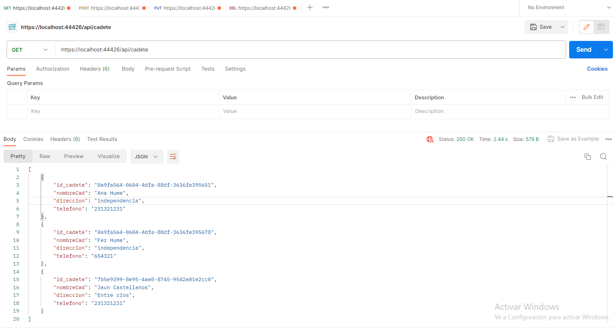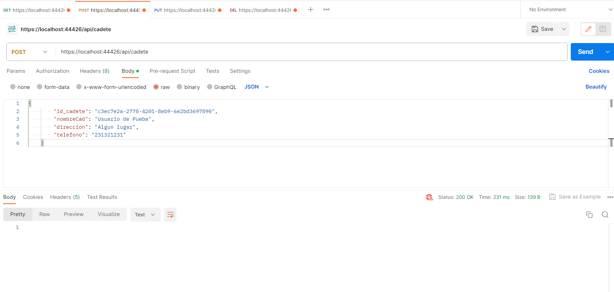
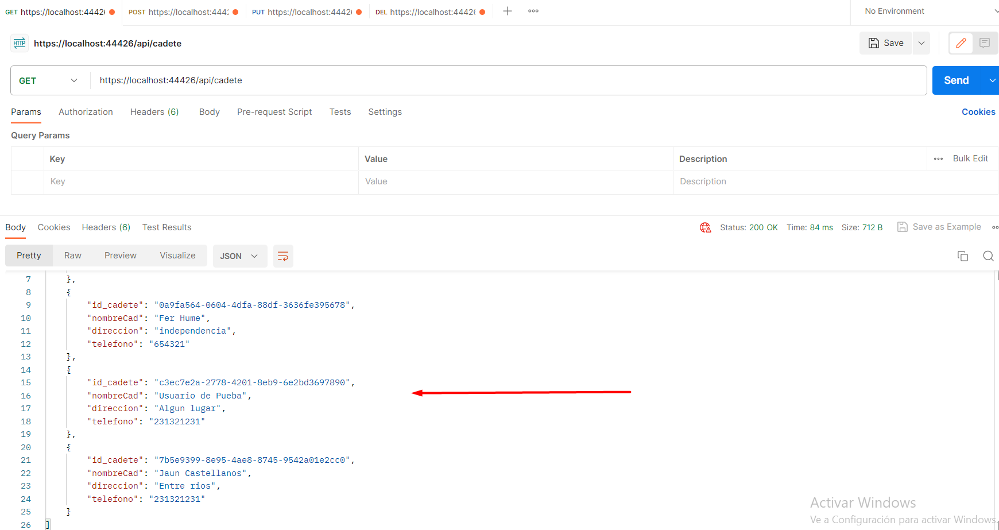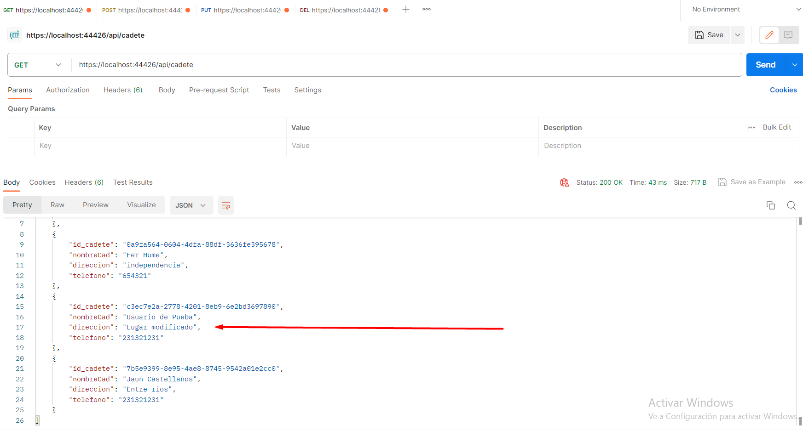
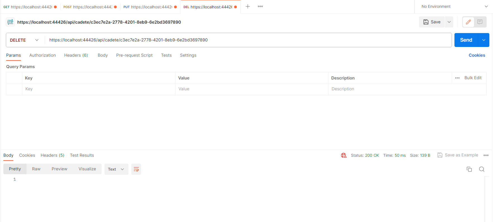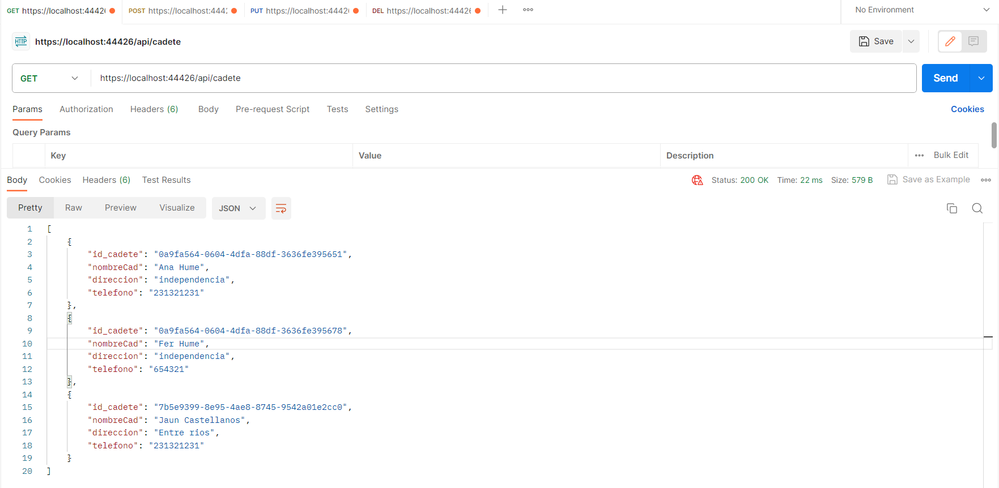

>Nota: El valor de el localhost puede variar, si es tu primera vez coloca en postman el valor del localhost que aparecio en tu navegador cuando lo corriste por primera vez.

## Frontend

El desarrollo web front-end consiste en la conversión de datos en una interfaz gráfica para que el usuario pueda ver e interactuar con la información de forma digital usando HTML, CSS y JavaScript. Como nosotros estamos usando React.js vamos a usar sus herramientas para crear esta interfaz.

Comencemos con eliminar 3 archivos que no vamos a usar la carpte de components (Counter, FetchDAta y Home) Luego crearemos las carpetas con los archivos que vamos a usar.

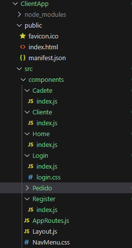

Esta imagen solo tiene algunos componente, el resto se iran agregando, aunque algunos de ellos no sean usados en esta explicacion.

Primero vamos a crear un archivo Helpers que nos ayudara a conectarnos a nuestra base de datos mientras consumimos Api.

**Path:/ClientApp/src/Helper.js**

    export const helpHttp = () => {
        const customFetch = (endpoint, options) => {
            const defaultHeader = {
                accept: "application/json",
            };

            const controller = new AbortController();
            options.signal = controller.signal;

            options.method = options.method || "GET";
            options.headers = options.headers
                ? { ...defaultHeader, ...options.headers }
                : defaultHeader;

            options.body = JSON.stringify(options.body) || false;
            if (!options.body) delete options.body;
            //console.log(options);

            setTimeout(() => controller.abort(), 3000);

            return fetch(endpoint, options)
                .then((res) =>
                    res.ok
                        ? res.json()
                        : Promise.reject({
                            err: true,
                            status: res.status || "00",
                            statusText: res.statusText || "Ocurrió un error",
                        })
                )
                .catch((err) => err);
        };

        const get = (url, options = {}) => customFetch(url, options);

        const post = (url, options = {}) => {
            options.method = "POST";
            return customFetch(url, options);
        };

        const put = (url, options = {}) => {
            options.method = "PUT";
            return customFetch(url, options);
        };

        const del = (url, options = {}) => {
            options.method = "DELETE";
            return customFetch(url, options);
        };

        return {
            get,
            post,
            put,
            del,
        };
    };

Este archivo fue facilitado por [Jonmircha](https://jonmircha.com/react). Dejo su página para Agradecer el aporte y Compartirlo con ustedes.

Antes de comenzar quiero recordarles que si bien react nos da una gran facilidad para poder reciclar codigo, si esto compromente la lectura y compresion esto pasa a formar parte de las malas practicas. Sin embargo voy a mostrar algunos metodos interesantes que podemos hacer uso con react solo de manera demostrativa. Con la experiencia y un buen equipo, podras determinar cuando es bueno que tu codigo tenga "esta funcion" y cuando no.

Comencemos por formar las rutas. Para empezar nos dirigiremos a nuestro archivo AppRoute para hacer algunos cambios. Para esta explicacion voy tocar muy poco de React-router porque es un tema que se complementara en la segunda parte de una manera mas detallada.
**Path:ClientApp/src/AppRoutes.js**

    import Login from "./components/Login";
    import Register from "./components/Register";
    import Home from './components/Home';
    import Cadete from './components/Cadete';
    import Pedido from './components/Pedido';
    import Cliente from './components/Cliente';
    import Error from "./components/Error";
    import Usuarios from "./components/User";

    const AppRoutes = [
    {
        index: true,
        name: "Home",
        path: '/',
        element: <Home />
    },
    {
        name: "Cadete",
        path: '/cadete',
        element: <Cadete />
    },
    {
        name: "Cliente",
        path: '/cliente',
        element: <Cliente />
    },
    {
        name: "Pedido",
        path: '/pedido',
        element: <Pedido />
    },
    {
        name: "Login",
        path: '/login',
        element: <Login />
    },
    {
        name: "Register",
        path: '/register',
        element: <Register />
    },
    {
        name: "Usuarios",
        path: '/Usuarios',
        element: <Usuarios />
    },
    {
        path: '*',
        private: false,
        element: <Error />,
    }
    ];

    export { AppRoutes };

En este array vamos a tener nuestras rutas que podremos acceder. Luego vamos a ir a nuestro archivo NavMenu donde vamos a hacer algunos cambios para que se adapten a nuestra forma de trabajar en el futuro.

**Path:ClientApp/src/Components/NavMenu.js**

import React, { useState } from 'react';
import { Collapse, Navbar, NavbarBrand, NavbarToggler, NavItem, NavLink } from 'reactstrap';
import { Link } from 'react-router-dom';
import { AppRoutes } from "../AppRoutes";
import './NavMenu.css';

    const NavMenu = () => {

    const [collapsed, setCollapsed] = useState(true);

    const toggleNavbar = (e) => {
        setCollapsed(!collapsed)
    }

    return (
        <header>
        <Navbar className="navbar-expand-sm navbar-toggleable-sm ng-white border-bottom box-shadow mb-3" container light>
            <NavbarBrand tag={Link} to="/">Cadeteria</NavbarBrand>
            <NavbarToggler onClick={toggleNavbar} className="mr-2" />
            <Collapse className="d-sm-inline-flex flex-sm-row-reverse" isOpen={!collapsed} navbar>
            <ul className="navbar-nav flex-grow">
                {AppRoutes.map((route, index) => {
                const { path, ...rest } = route;
                return (
                    <NavItem key={rest.name + index}>
                    <NavLink tag={Link} className="text-dark" to={path}>{rest.name}</NavLink>
                    </NavItem>
                )
                })}
            </ul>
            </Collapse>
        </Navbar>
        </header>
    );

    }

    export default NavMenu;

Y para probar que todo anda a cada componente, vamos a crear una interfaz sensilla para que sea visualizada en cada uno de nuestros endpoint.

**Path:ClientApp/src/Components/Home/index.js**

    import React from "react";

    const Home = () => {
        return (
            <>
                

                    <h1 className="text-center text-white">Proyecto cadeteria con ASP.Net y React.js </h1>.
                

            </>
        )
    }

    export default Home;

>nota: queda a contenido del lector que cree el resto de los archivos de la misma manera, no tiene sentido escribir tantas veces lo mismo en una explicacion. Cada componente tendrea un index y cada index tendra su propias vistas que se exportaran.

## Conexion a la base de datos.

Para la Conexion vamos a usar la helpers que va a tener el cuerpo que necesita para que podamos hacer una peticion a nuestra Api, luego vamos a crear un nuevo archivo js llamado ApiContext.
**Path:AppClient/src/ApiContext.js**

    import React from "react";
    import { useState, useEffect } from "react";
    import { helpHttp } from "./Helper";

    const GlobalContext = React.createContext();

    const ContextProvider = (props) => {

        const [db, setDb] = useState([]);
        const [dataToEdit, setDataToEdit] = useState(null);
        const [url, setUrl] = useState(null);

        const [loading, setLoading] = useState(false);
        const [error, setError] = useState(false);

        const api = helpHttp();

        useEffect(() => {
            setLoading(true);
            helpHttp().get(url).then((res) => {
                if (!res.err) {
                    setDb(res);
                    setError(null);
                } else {
                    setDb(null);
                    setError(res);
                }
                setLoading(false);
            });
        }, [url, db]);

        const createData = (data) => {
            delete data.id
            let options = {
                body: data,
                headers: { "content-type": "application/json" },
            };
            helpHttp().post(url, options).then((res) => {
                if (!res.err) {
                    setDb([...db, res]);
                    
                } else {
                    setError(res);
                }
            })
        }

        const updateData = (data) => {
            let id = data.id_cadete || data.id_cliente;
            var newData;
            let endpoint = `${url}/${id}`;
            let options = {
                body: data,
                headers: { "content-type": "application/json" },
            };
            console.log(data)
            api.put(endpoint, options).then((res) => {
                if (!res.err) {
                    if (data.id_cadete) {
                        newData = db.map((el) => (el.id_cadete === data.id_cadete ? data : el));
                    } else {
                        newData = db.map((el) => (el.id_cliente === data.id_cliente ? data : el));
                    }
                    setDb(newData);
                } else {
                    setError(res);
                }
            });
        }

        const deleteData = (id) => {
            let isDelete = window.confirm(
                `¿Estás seguro de eliminar el registro con el id '${id}'?`
            );
            if (isDelete) {
                let endpoint = `${url}/${id}`;
                let options = {
                    headers: { "content-type": "application/json" },
                };
                api.del(endpoint, options).then((res) => {
                    if (!res.err) {
                        let newData = db.filter((el) => el.id !== id);
                        setDb(newData);
                    } else {
                        setError(res);
                    }
                });
            } else {
                return;
            }
        }

        return (
            <GlobalContext.Provider value={{
                db,
                setDb,
                url,
                setUrl,
                dataToEdit,
                setDataToEdit,
                error,
                setError,
                loading,
                setLoading,
                createData,
                deleteData,
                updateData,
            }} >
                {props.children}
            </GlobalContext.Provider>
        )
    }

    export { ContextProvider, GlobalContext }

En este archivo no solo vamos a guardar las funciones que nos permitiran acceder a los controladores sino tambien valores que vamos a ir necesitando para darle una mejor experiencia al usuario.

Para poder llamar a nuestro Context vamos a tener que llamarlo, segun sea necesario. Como esto es explicativo, vamos a llamarlo en nuestro archivo principal.
**Path:AppClient/src/index.js

    import 'bootstrap/dist/css/bootstrap.css';
    import React from 'react';
    import { createRoot } from 'react-dom/client';
    import { BrowserRouter } from 'react-router-dom';
    import App from './App';
    import * as serviceWorkerRegistration from './serviceWorkerRegistration';
    import reportWebVitals from './reportWebVitals';
    import { ContextProvider } from './ApiContext';

    const baseUrl = document.getElementsByTagName('base')[0].getAttribute('href');
    const rootElement = document.getElementById('root');
    const root = createRoot(rootElement);

    root.render(
    <ContextProvider>
        <BrowserRouter basename={baseUrl}>
        <App />
        </BrowserRouter>
    </ContextProvider>
    );

    reportWebVitals();

Los primeros Componentes que son mas faciles de trabajar, son los componentes de Cadetes y Clientes Ya que solo se trata de hacer un simple CRUD. El componente de pedidos van mostrar un poco mas de trabajo ya que necesitamos capturar el id del cliente y por ultimo estaran las tablas de CadetePedido y ClientePedido que tendran que cargarse al tomar una solicitud.

**Path:AppClient/src/Cadete/index.js**

    import React from "react";
    import Loader from "../Loader";
    import Form from '../Form';
    import { GlobalContext } from "../../ApiContext";
    import { useNavigate } from "react-router-dom";

    const InitialForm = {
        nombreCad: "",
        direccion: "",
        telefono: "",
    }
    const Cadete = () => {

        const navigate = useNavigate();
        const {
            db,
            url,
            setUrl,
            dataToEdit,
            setDataToEdit,
            loading,
            createData,
            deleteData,
            updateData,
        } = React.useContext(GlobalContext)

        setUrl("/api/cadete")

        const handelRedirect = (id) => {
            //tomar pedido
        }
        const handelRedirectTo = (id) => {
            //pedido cancelado/completado
        }

        return (
            <>
                

                    <h1 className="text-center ">Seccion de cadetes</h1>.
                

                {loading && <Loader />}
                {db && (
                    

                        <table className='table ' aria-labelledby="tabelLabel">
                            <thead className="table-borderless bg-dark bg-gradient">
                                <tr className=" text-white">
                                    <th>Nombre</th>
                                    <th>Direccion</th>
                                    <th>Telefono</th>
                                    <th>Asignar pedido</th>
                                    <th>Completar/Cancelar</th>
                                    <th>Actualizar</th>
                                    <th>Borrar</th>
                                </tr>
                            </thead>
                            <tbody>
                                {db.length > 0 ?
                                    (db.map((data) =>
                                        <tr key={data.nombreCad}>
                                            <td>{data.nombreCad}</td>
                                            <td>{data.direccion}</td>
                                            <td>{data.telefono}</td>
                                            <td>
                                                <button className="btn btn-outline-primary" onClick={() => handelRedirect(data.id_cadete)}>Obtener</button>
                                            </td>
                                            <td>
                                                <button className="btn btn-outline-primary" onClick={() => handelRedirectTo(data.id_cadete)}>Completar/Cancelar</button>
                                            </td>
                                            <td>
                                                <button className="btn btn-outline-primary" onClick={() => setDataToEdit(data)}>Editar</button>
                                            </td>
                                            <td>
                                                <button className="btn btn-outline-primary" onClick={() => deleteData(data.id_cadete)}>Eliminar</button>
                                            </td>
                                        </tr>
                                    )) : (
                                        <tr>
                                            <td colSpan="6">Sin datos</td>
                                        </tr>
                                    )}
                            </tbody>
                        </table>
                    

                )}
                <Form
                    InitialForm={InitialForm}
                    createData={createData}
                    updateData={updateData}
                    dataToEdit={dataToEdit}
                    setDataToEdit={setDataToEdit}
                    url={url}
                />
            </>
        );
    }

    export default Cadete;

Nuestro vista de Cadete vemos que contiene el archivo un condicional.

    {loading && <Loader />}

Este condicional va a renderizar el Loader o pantalla de carga, mientras se hace una peticion a la Api, esta peticion esta en nuestro archivo ApiContext, en el UseuseEffect

    useEffect(() => {
        setLoading(true);
        helpHttp().get(url).then((res) => {
            if (!res.err) {
                setDb(res);
                setError(null);
            } else {
                setDb(null);
                setError(res);
            }
            setLoading(false);
        });
    }, [url]);

Aqui nosotros establecemos el valor de loading como **true**, Al ser verdadero el componente se visualizara y una vez terminado la peticion esta loading pasara a ser **false** lo que quitara la pantalla y mostrara el resto de los componentes.

Para reutizar este UseEffect, estableci como condicion la url que vamos pidiendo cada vez que renderizamos un componente. Por el momento estamos haciendolo de manera manual, pero hay funciones que capturan la url.

De aqui tenemos un table donde se iteraran los valores que vienen de la base de datos o se colocara un mensaje que no contiene valores en el caso de que no tenga datos que mostrar.

Por ultimo tenemos un formulario un poco complicado, pero que haciendo uso de React podremos reutilizar. Antes de explicarlo veamos sus funcion.

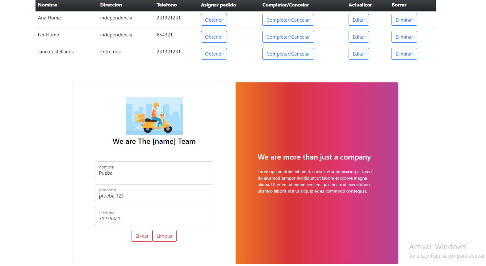
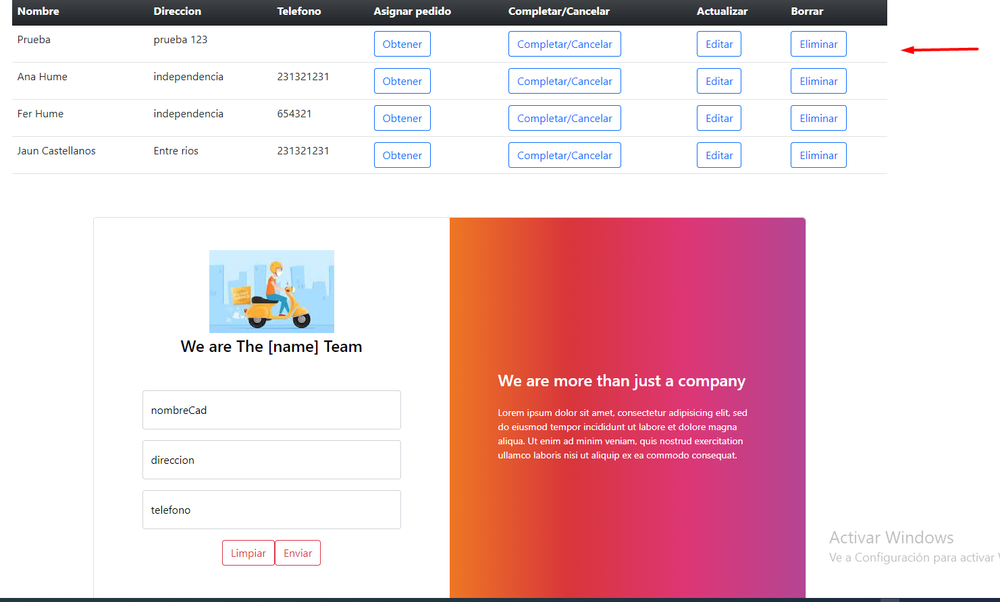
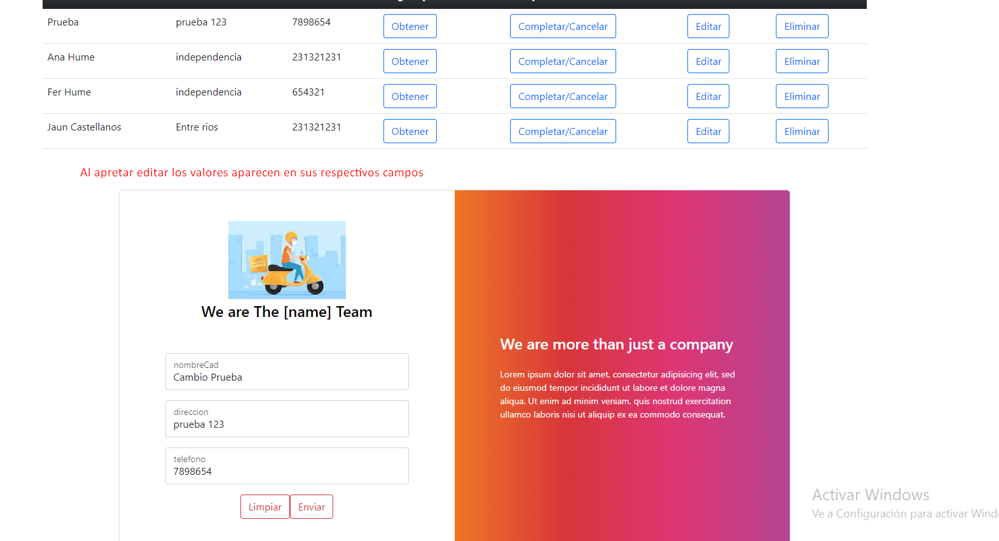
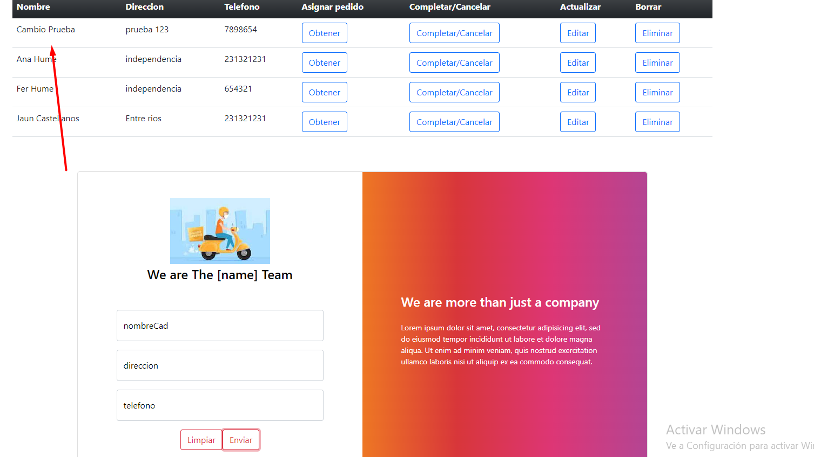
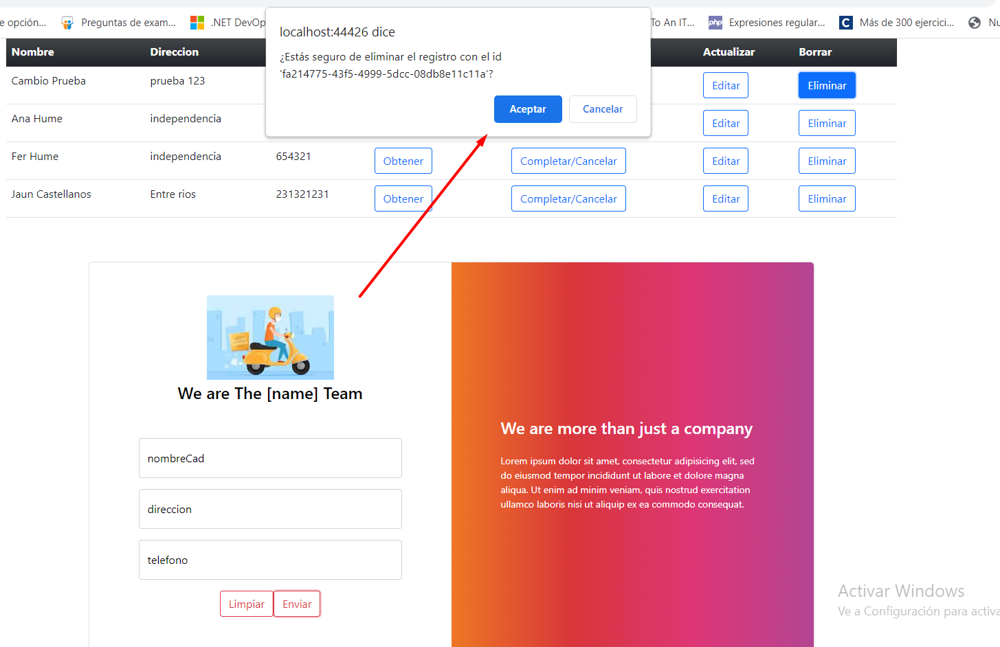

## Formulario compartido

Como Ya anticipe, el formulario era un poco complicado de expplicar debido a que no solo se usaba para los cadetes, sino que tambien se usaba para los clientes.

**Path:ClienApp/src/components/form/index.js**

    import React, { useState, useEffect } from "react"
    import Input from "./Input";

    import "./form.css"

    const FormApi = ({ InitialForm, createData, updateData, dataToEdit, setDataToEdit, url }) => {
        const [form, setForm] = useState(InitialForm);
        let array = Object.getOwnPropertyNames(form)
        const [img, setImg] = useState("")

        useEffect(() => {
            if (url == "/api/cadete") {
                setImg("./img/cadete.png")
            } else {
                setImg("./img/pedido.jpg")
            }
        }, [url])

        useEffect(() => {
            if (dataToEdit) {
                setForm(dataToEdit);
            } else {
                setForm(InitialForm);
            }
        }, [dataToEdit]);

        const handleSubmit = (e) => {
            e.preventDefault();
            if (!form.id_cadete && !form.id_cliente) {
                createData(form)
            } else {
                updateData(form);
            }
            handleReset();
        };

        const handleChange = (e) => {
            setForm({
                ...form,
                [e.target.name]: e.target.value,
            });
        };

        const handleReset = () => {
            setForm(InitialForm);
            setDataToEdit(null);
        };

        return (
            <section className="gradient-form" >
                

                    

                        

                            

                                

                                    

                                        

                                            

                                                
                                                <h4 className="mt-1 mb-5 pb-1">We are The [name] Team</h4>
                                            

                                            <form onSubmit={handleSubmit}>
                                                {array.map((d, index) => {
                                                    if (d === 'id_cliente' || d === 'id') return
                                                    if (d === 'id_cadete') return;
                                                    else {
                                                        return (
                                                            

                                                                <Input
                                                                    placeholder={d}
                                                                    name={d}
                                                                    value={form[d]}
                                                                    handleChange={handleChange}
                                                                />
                                                            

                                                        );
                                                    }
                                                })}
                                                

                                                    <input className="btn btn-outline-danger" type="reset" value="Limpiar" onClick={handleReset} />
                                                    <input className="btn btn-outline-danger" type="submit" value="Enviar" />
                                                

                                            </form>

                                        

                                    

                                    

                                        

                                            <h4 className="mb-4">We are more than just a company</h4>
                                            
Lorem ipsum dolor sit amet, consectetur adipisicing elit, sed do eiusmod
                                                tempor incididunt ut labore et dolore magna aliqua. Ut enim ad minim veniam, quis nostrud
                                                exercitation ullamco laboris nisi ut aliquip ex ea commodo consequat.

                                        

                                    

                                

                            

                        

                    

                

            </section >
        )
    }

    export default FormApi;

Este componente cuenta con un propio componente al que llamado input. el cual a travez de un map va ir cargando los valores de acuerdo al objeto que le traigamos.

    let array = Object.getOwnPropertyNames(form)

>Nota: tanto el cliente como cadetes envian el valor inicial de su formularios, este valor es capturado por nuestro UseEffect, si hay valor tomara del dato que queremos modificar, sino el valor que viene por defecto. de esa manera extraemos los propiedades del objeto que enviamos y determinaramos el tipo de input que crearemos.

Como se puede apreciar el map tiene condicionales para evitar crear nuevos input en el caso del Id, en el caso de no tener uno se hara una solicitud de tipo Post y en el caso de encontrar uno se creara una de tipo Put.

Todo lo que no sea un Id se renderizara y en el vamos a pasarles sus propias props .

**Path:ClientApp/src/componente/Form/Input.js**

    const Input = ({ placeholder, name, value, handleChange }) => {

        return (
            <>
                <input
                    type="tex"
                    className="form-control"
                    id={name}
                    placeholder={placeholder}
                    name={name}
                    value={value || ''}
                    onChange={(event) => handleChange(event)}
                />
                <label className="form-label" htmlFor={name}>{name}</label>
            </>
        )
    }

    export default Input

En este input declaramos que es de tipo text, su id, su valor predefinido, el nombre del input , la funcion que captura su valor son valores que nos llegan desde componente padre.

Es un poco complicado Entender a primera y, aunque puede parecer algo muy avanzado y sotisficado este formulario entra dentro de lo que es una mala practica.

¿Hace su funcion? Si. ¿a que precio?
- Se pierde la legibilidad del codigo.
- Los input tendran el mismo tipo de **type** ya que mifificarlos implicaria una gran demanda.
- Los label comenzaran con minuscula, lo que implica implementar logica externa para que el usuario de manera estandar.
- hay un mayor consumo al implementar demaciada validaciones.

¿Tiene Beneficios?
- Hay una reutilizacion de codigo.
- Se ve genial y te hace sentir todo un pro.

Sin embargo es bueno conocer este tipo de funciones que podemos hacer con React, ya que nunca se sabe cuando podremos usar este tipo de logica en un trabajo muy especifico, como por ejemplo crear input bajo demanda(agregar nuevos input con un boton).

Veamos el componente cliente y entenderemos la similitudes.

**Path:AppClient/src/Cliente/index.js**

    import React from "react"
    import Form from '../Form';
    import { GlobalContext } from "../../ApiContext";
    import Loader from "../Loader";
    import { useNavigate } from "react-router-dom";

    const InitialForm = {
        id: null,
        nombre: "",
        direccion: "",
        telefono: "",
        referencia: ""
    }

    const Cliente = () => {
        const navigate = useNavigate();
        const {
            db,
            setUrl,
            dataToEdit,
            setDataToEdit,
            loading,
            createData,
            deleteData,
            updateData,
        } = React.useContext(GlobalContext)

        setUrl('/api/cliente')

        const handelRedirect = (data) => {
            //hacer un pedido
        }

        return (
            <>
                

                    <h1 className="text-center ">Seccion de clientes</h1>
                

                {loading && <Loader />}
                {db && (
                    

                        <table className='table ' aria-labelledby="tabelLabel">
                            <thead className="table-borderless bg-dark bg-gradient">
                                <tr className=" text-white">
                                    <th>Nombre</th>
                                    <th>Direccion</th>
                                    <th>Telefono</th>
                                    <th>Pedido</th>
                                    <th>Editar</th>
                                    <th>Eliminar</th>
                                </tr>
                            </thead>
                            <tbody>
                                {db.length > 0 ?
                                    (db.map((data) =>
                                        <tr key={data.nombre}>
                                            <td>{data.nombre}</td>
                                            <td>{data.direccion}</td>
                                            <td>{data.telefono}</td>
                                            <td>
                                                <button className="btn btn-outline-primary" onClick={() => handelRedirect(data)}>Nuevo</button>
                                            </td>
                                            <td>
                                                <button className="btn btn-outline-primary" onClick={() => setDataToEdit(data)}>Editar</button>
                                            </td>
                                            <td>
                                                <button className="btn btn-outline-primary" onClick={() => deleteData(data.id_cliente)}>Eliminar</button>
                                            </td>
                                        </tr>

                                    )) : (
                                        <tr>
                                            <td colSpan="3">Sin datos</td>
                                        </tr>
                                    )}
                            </tbody>
                        </table>
                    

                )}
                <Form
                    InitialForm={InitialForm}
                    createData={createData}
                    updateData={updateData}
                    dataToEdit={dataToEdit}
                    setDataToEdit={setDataToEdit}
                />

            </>
        );
    }
    export default Cliente;

## Creacion de Pedidos.

Como ya escribimos anteriormente, anidad las solicitudes de pedido tiene un nivel de dificultad un poco mas elevado, porque necesitamos considerar los tres casos de relaciones de tablas que hicimos con fines puramentes practicos.

Como ya trabajamos para reciclar codigo, esta parte del trabajo vamos a dividir la logica para que cada componente se encargue de hacer lo que le corresponde.

Primero vamos a agregar las nuevas rutas a nuestro archivo AppRouter
**Path:ClientApp/src/AppRouter.js**

    const AppRoutes = [
        ...
        {
            invisible: true,
            path: '/tomarPedido',
            element: <TomarPedido />
        },
        {
            invisible: true,
            path: '/tomarPedido',
            element: <TomarPedido />
        },
        {
            invisible: true,
            path: '/ActionPedido',
            element: <ActionPedido />
        },
        {
            path: '*',
            private: false,
            element: <Error />,
        }
    ];

Luego en nuestro componente nav agregamos la condicion para evitar que este se renderise.
**Path:ClientApp/src/NavMenu.js**

    const NavMenu = () => {

    const [collapsed, setCollapsed] = useState(true);
    const toggleNavbar = (e) => {
        setCollapsed(!collapsed)
    }

    return (
        <header>
        <Navbar className="navbar-expand-sm navbar-toggleable-sm ng-white border-bottom box-shadow mb-3" container light>
            <NavbarBrand tag={Link} to="/">Cadeteria</NavbarBrand>
            <NavbarToggler onClick={toggleNavbar} className="mr-2" />
            <Collapse className="d-sm-inline-flex flex-sm-row-reverse" isOpen={!collapsed} navbar>
            <ul className="navbar-nav flex-grow">
                {AppRoutes.map((route, index) => {
                const { path, ...rest } = route;
                if (rest.invisible) return null;
                else {
                    return (
                    <NavItem key={rest.name + index}>
                        <NavLink tag={Link} className="text-dark" to={path}>{rest.name}</NavLink>
                    </NavItem>
                    )
                }
                })}
            </ul>
            </Collapse>
        </Navbar>
        </header>
    );
    }

Comencemos por crear la vista que nos mostrara los pedidos que tenemos en nuestra base de datos.
**Path:AppClient/src/components/Pedido/index.js**

import React from "react"
import { GlobalContext } from "../../ApiContext";
import Loader from "../Loader";
import { useNavigate } from "react-router-dom";

const Pedido = () => {
    const navigate = useNavigate();

    const {
        db,
        setUrl,
        loading,
        deleteData,
    } = React.useContext(GlobalContext)

    setUrl("/api/pedido")

    const HandelEdit = (data) => {
        delete data.nombre
        navigate("/FormPedido", { state: { data } })
    }

    return (
        <>
            

                <h1 className="text-center text-white">Seccion de pedidos</h1>
            

            {loading && <Loader />}
            {db && (
                

                    <table className='table ' aria-labelledby="tabelLabel">
                        <thead className="table-borderless bg-dark bg-gradient">
                            <tr className=" text-white">
                                <th>Obs</th>
                                <th>Estado</th>
                                <th>Cliente</th>
                                <th>Editar</th>
                                <th>Eliminar</th>
                            </tr>
                        </thead>
                        <tbody>
                            {db.length > 0 ?
                                (db.map((data) =>
                                    <tr key={data.obs}>
                                        <td>{data.obs}</td>
                                        <td>{data.estado}</td>
                                        <td>{data.nombre}</td>
                                        <td>
                                            <button className="btn btn-outline-primary" onClick={() => HandelEdit(data)}>Editar</button>
                                        </td>
                                        <td>
                                            <button className="btn btn-outline-primary" onClick={() => deleteData(data.id_pedido)}>Eliminar</button>
                                        </td>
                                    </tr>

                                )) : (
                                    <tr>
                                        <td colSpan="5">Sin datos</td>
                                    </tr>
                                )}
                        </tbody>
                    </table>
                

            )}
        </>
    )
}
export default Pedido;

Aqui tenemos una simple tabla con algunas Acciones simples, El ya antes visto boton de Eliminar y el nuevo metodo de editar, que nos va a enviar el objeto que señalemos a nuestro formulario de pedido a travez de la UseNavigation de react.

**Path:AppClient/src/components/FormPedido/index.js**

    import React, { useEffect, useState } from "react"
    import { GlobalContext } from "../../ApiContext";
    import { useLocation } from "react-router-dom";

    const InitialForm = {
        id: null,
        ClienteForeingKey: null,
        obs: "",
        estado: "Pendiente",
    }

    const FormPedido = () => {

        const {
            setUrl,
            dataToEdit,
            setDataToEdit,
            createData,
            updateData,
        } = React.useContext(GlobalContext)
        setUrl('/api/pedido')

        const { state } = useLocation();

        const [form, setForm] = useState(InitialForm);

        useEffect(() => {
            if (state.data.id_pedido) {
                setForm(state.data);
            } else {
                setForm(InitialForm);
            }
        }, [dataToEdit]);

        const handleSubmit = (e) => {
            e.preventDefault();
            if (form.id_pedido) {
                updateData(form);
            } else {
                form.ClienteForeingKey = state.data.id_cliente;
                createData(form)
            }

            handleReset();
            navigate('/pedido', { replace: true })
        };

        const handleChange = (e) => {
            setForm({
                ...form,
                [e.target.name]: e.target.value,
            });
        };

        const handleReset = () => {
            setForm(InitialForm);
            setDataToEdit(null);
        };

        return (
            <>
                

                    <h1 className="text-center text-white">Formulario pedidos nuevos </h1>
                

                

                    

                        <form className="border p-3 form" onSubmit={handleSubmit}>
                            

                                

                                    <label htmlFor="obs" className="me-2"> Obs</label>
                                    <input value={form.obs} onChange={handleChange} name="obs" id="obs" />
                                

                                

                                    <input className="btn btn-outline-primary" type="submit" value="Enviar" />
                                    <input className="btn btn-outline-primary" type="reset" value="Limpiar" onClick={handleReset} />
                                

                            

                        </form>
                    

                

            </>
        )
    }

    export default FormPedido;

Hasta ahora lo unico nuevo es el UseLocalitation, este metodo nos va a permitir capturar el objeto que enviamos a travez de Usenavigation. De aqui el formulario es el mismo, si el objeto existe el formulario tomara el valor que traimos, de lo contrario sera un formulario en blanco

Hasta aqui, si queermos leer, sobreescribir y eliminar desde nuestra tabla de pedido, podemos comporbarlo, pero si queremos escribir un pedido nuevo vamos a necesitar el id_cliente que obtenemos del cliente que hace la solicitud.
En este componente teniamos una funcion en blanco llamada handelRedirect, bueno ahora vamos a hacer uso de Use Navigate para enviar los datos que queiramos.
**Path/ClientApp/src/components/cliente/index.js**

    const handelRedirect = (data) => {
        //hacer un pedido
        navigate("/FormPedido", { state: { data } })
    }

Esto va a ser interceptado por el UseLocalization y podremos acceder los valores que inviamos y aunque nosotros solo hacemos uso del Id, quiero aqui mostrar que podemos enviar el objeto completo si asi lo queremos.
Este id, lo ingresaremos antes de llamar a nuestra funcion updateData, sin embargo vamos a tener que hacer una ultima modificacion, para que esto funcione
**Path/ClientApp/src/ApiCntext.js**

    const updateData = (data) => {
        let id = data.id_cadete || data.id_cliente || data.id_pedido;
        var newData;
        let endpoint = `${url}/${id}`;
        let options = {
            body: data,
            headers: { "content-type": "application/json" },
        };
        api.put(endpoint, options).then((res) => {
            if (!res.err) {
                if (data.id_cadete) {
                    newData = db.map((el) => (el.id_cadete === data.id_cadete ? data : el));
                } if (data.id_cliente) {
                    newData = db.map((el) => (el.id_cliente === data.id_cliente ? data : el));
                } else {
                    newData = db.map((el) => (el.id_pedido === data.id_pedido ? data : el));
                }
                setDb(newData);
            } else {
                setError(res);
            }
        });
    }

Esto nos lleva a un nuevo problema, mientras mas tablas necesitemos actualizar, mayor sera la cantidad de validaciones que tendremos que hacer, haciendo el codigo ineficiente.
Una solucion seria llamar todos los valores los identificadores con el mism nombre, pero esto ocacionaria conflictos si necesitamos el id en una solicitud join, es por eso que se recomienda nombrar a las claves foraneas como Foreinkey<Name> de esa manera evitar este problema.

>Nota: si desea implementar el cambio que sugeri, sera dejado como reto despues de todo este contenido es puramente demostrativo por lo que veo mayor merito en llegar a estas malas practicas y resaltar sus problemas.

## Relaciones Cadete-cliente y Cadete-pedido

Llegamos al ultimo tema que vamos a tratar en esta parte y se trata relacionadas por una tabla intermedia. Aunque el ejemplo que di no puede ser verdaderamente descriptivo, confio que al llegar a este tutorial tu conocimientos sobre base de datos, asp.net y react deben ser por lo menos el de un Jr.

Comencemos con la relacion Cadete-pedido. En si, para un trabajo que solo tiene que funcionar no hay necesidad de tener una relacion Cadete-cliente, despues de todo a travez de multiples join uno puede obtener los mismos resultados.
Pero para un trabajo en desarrollo es necesario crear esta tabla si es que se necesita acecer a sus datos, aun cuando sea solo para un historial.
**Path/ClientApp/src/components/cadete/index.js**

        const handelRedirect = (id) => {
            //tomar pedido
            navigate("/TomarPedido", { state: { id } })
        }
        const handelRedirectTo = (id) => {
            //pedido cancelado/completado
            navigate("/actionPedido", { state: { id } })
        }

Si volvemos a nuestro componente cadete, nos encontraremos con sos funciones que estaban destianda a que el cadete Tomara el pedido y a que informara de su cancelacion o cumplimiento sea cual sea el caso.
Si bien mi mente no me dio lo suficiente para pensar en nombre adecuados en este momento, dejamos comentarios para dar a conocer la funciones de cada uno. Ahora vamos a enviar, esta vez solo el Id, a nuestros dos componentes.
Comencemos con el TomarPedidos
**Path/ClientApp/src/components/TomarPedidos/index.js**

    import React from "react"
    import { GlobalContext } from "../../ApiContext";
    import Loader from "../Loader";
    import { useLocation, useNavigate } from "react-router-dom";

    const TomarPedido = () => {
        const { state } = useLocation();

        const nav = useNavigate();

        const {
            db,
            setUrl,
            loading,
            updatePedido,
            createCp,
        } = React.useContext(GlobalContext)

        setUrl("/api/cadetepedido")

        const Tomar = (id_cadete, data) => {
            delete data.nombre;
            const cp = {
                CadeteForeiingKey: id_cadete,
                PedidoForeiingKey: data.id_pedido,
            }
            data.estado = "En camino"
            updateWihtUrl(data, "url")
            createData(cp);
            nav("/Cadete")
        }

        return (
            <>
                

                    <h1 className="text-center text-white ">Lista de pedidos</h1>
                

                {loading && <Loader />}
                {db && (
                    <table className='table table-striped w-75 mx-auto' aria-labelledby="tabelLabel">
                        <thead>
                            <tr>
                                <th>Obs</th>
                                <th>Estado</th>
                                <th>Cliente</th>
                                <th>Tomar</th>
                            </tr>
                        </thead>
                        <tbody>
                            {db.length > 0 ?
                                (db.map((data) =>
                                    <tr key={data.obs}>
                                        <td>{data.obs}</td>
                                        <td>{data.estado}</td>
                                        <td>{data.nombre}</td>
                                        <td>
                                            <button className="btn btn-outline-primary" onClick={() => Tomar(state.id, data)}>Tomar</button>
                                        </td>
                                    </tr>
                                )) : (
                                    <tr>
                                        <td colSpan="5">Sin datos</td>
                                    </tr>
                                )}
                        </tbody>
                    </table>
                )}
            </>
        )
    }
    export default TomarPedido;

Avanzados hasta aqui nos encotramos con otro problema, Ahora necesitamos hacer dos solicitudes a dos tablas diferentes. pero de acuerdo a nuestra logica inicial, nosotros inicializabamos nuestra ruta o url para que nuestro UseEffect reaccionara a los cambios y trajera los valores de nuestra base de datos de acuerdo a nuestro nuevo endpoint.
Ahora este truco nos juega en contra, porque no podemos volver a inicializar la url, porque nos activaria la condicion de nuestro UseEffect y renderizaria todo de nuevo.
Por lo que la solucion mas rapida seria crear una segunda funcion que hiciera lo mismo, pero que recibiera la url como parametro
**Path:AppClient/src/ApiContext.js**

    const updateWihtUrl = (data, url) => {
        let id = data.id_cadete || data.id_cliente || data.id_pedido;
        var newData;
        let endpoint = `${url}/${id}`;
        let options = {
            body: data,
            headers: { "content-type": "application/json" },
        };
        api.put(endpoint, options).then((res) => {
            if (res.err) setError(res);
            else return null;
        });
    }

como no necesitamos renderizar nada con esta funcion simplemente podemos devolver un mensaje, por el momento devolvamos un null.
En cuanto a la logica es muy simple, en un simple boton activamos el envento que capturara el id del cadete que trajimos desde la vista de los cadetes, y el objeto completo de la relacion clientePedido. Este si hiciste los ejercicios sabas que trae 5 atributos: Nombre, id_pedido, id_cliente, estado, obj.

    const Tomar = (id_cadete, data) => {
        delete data.nombre;
        const cp = {
            CadeteForeiingKey: id_cadete,
            PedidoForeiingKey: data.id_pedido,
        }
        data.estado = "En camino"
        updateWihtUrl(data, "/api/pedido")
        createData(cp);
        nav("/Cadete")
    }

simplemente eliminamos el nombre del objeto para que coincida con el objeto que espera nuestro controlador, luego actualizamos el estado del pedido y hacemos las dos solicitudes.

Ahora podemos tomar el ultimo reto, que es completar cancelar el pedido que nos demanda borrar la relacion cadete-pedido y volver a actualizar la tabla de pedidos. O completar el pedido que implica crear una nueva relacion entre el cliente y el cadete, mientras actualizamos el valor del pedido a "completado".

    import React from "react"
    import { GlobalContext } from "../../ApiContext";
    import Loader from "../Loader";
    import { useLocation, useNavigate } from "react-router-dom";

    const ActionPedido = () => {
        const { state } = useLocation();
        const {
            db,
            setUrl,
            loading,
            CreateWihtUrl,
            updateWihtUrl,
            deleteWihtUrl
        } = React.useContext(GlobalContext)

        setUrl("/api/cadetepedido/action")
        const nav = useNavigate();

        const Entregar = (data) => {
            delete data.nombre;
            delete data.id_cadPed
            data.estado = "Entregado"
            const CC = {
                CadeteForeingKey: state.id,
                ClienteForeingKey: data.clienteForeingKey,
            }

            CreateWihtUrl(CC, "api/cadetecliente")
            updateWihtUrl(data, "api/pedido")
            nav("/Cadete")
        }
        const Cancelar = (data) => {
            let isDelete = window.confirm(
                `¿Estás seguro de cancelar el pedido con el id '${data.id_cadPed}'?`
            );
            if (isDelete) {
                deleteWihtUrl(data.id_cadPed, "/api/cadetepedido")

                delete data.nombre;
                delete data.id_cadPed
                data.estado = "Pendiente"

                updateWihtUrl(data, "api/pedido")
                nav("/Cadete")
            } else {
                return;
            }
        }

        return (
            <>
                

                    <h1 className="text-center text-white">Lista de pedidos</h1>
                

                {loading && <Loader />}
                {db && (
                    <table className='table table-striped w-75 mx-auto' aria-labelledby="tabelLabel">
                        <thead>
                            <tr>
                                <th>Obs</th>
                                <th>Estado</th>
                                <th>Cliente</th>
                                <th>Entregar/Cancelar</th>
                            </tr>
                        </thead>
                        <tbody>
                            {db.length > 0 ?
                                (db.map((data) =>
                                    <tr key={data.obs}>
                                        <td>{data.obs}</td>
                                        <td>{data.estado}</td>
                                        <td>{data.nombre}</td>
                                        <td>
                                            <button className="btn btn-outline-primary" onClick={() => Entregar(data)}>Entregar</button>
                                            <button className="btn btn-outline-primary" onClick={() => Cancelar(data)}>Cancelar</button>
                                        </td>
                                    </tr>
                                )) : (
                                    <tr>
                                        <td colSpan="5">Sin datos</td>
                                    </tr>
                                )}
                        </tbody>
                    </table>
                )}
            </>
        )
    }
    export default ActionPedido;

Siguiendo la linea de pensamiento hasta ahora, vamos a crear las otras dos funciones en nuestro context para poder realizar el trabajo que nos falta.

    const deleteWihtUrl = (id, url) => {
        let endpoint = `${url}/${id}`;
        let options = {
            headers: { "content-type": "application/json" },
        };
        api.del(endpoint, options).then((res) => {
            if (res.err) {
                setError(res);
            } else {
                let newData = db.filter((el) => el.id !== id);
                setDb(newData);
            }
        });
    }

    const CreateWihtUrl = (data, url) => {
        delete data.id
        let options = {
            body: data,
            headers: { "content-type": "application/json" },
        };
        helpHttp().post(url, options).then((res) => {
            if (res.err) {
                setError(res);
            } else {
                console.log(res);
                setDb([...db, res]);
            }
        })
    }

Con estos ultimos temas, podemos concluir la primera parte de 3 tutoriales sobre como Crear una aplicacion web usando Asp.net, Entity Frameork, react, autenticacion roles y permisos mediante uso de token